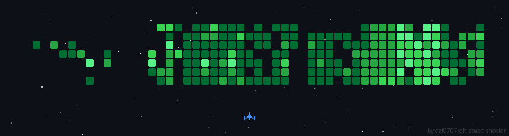

<h1 align="center">Hi, I'm Krishna</h1>

  

Full-Stack Developer · Building clean, scalable web apps · Open to opportunities

 &nbsp;&nbsp; 💡 Into Open Source & Competitive Programming &nbsp;·&nbsp; 📫 <a href="https://github.com/krishnapschauhan">GitHub</a>

 

## ⚡ Stack

 

 

## 📈 Stats

  
  

 

  

  
    
  <em>"Babumoshai, zindagi badi honi chahiye, lambi nahi."</em>

